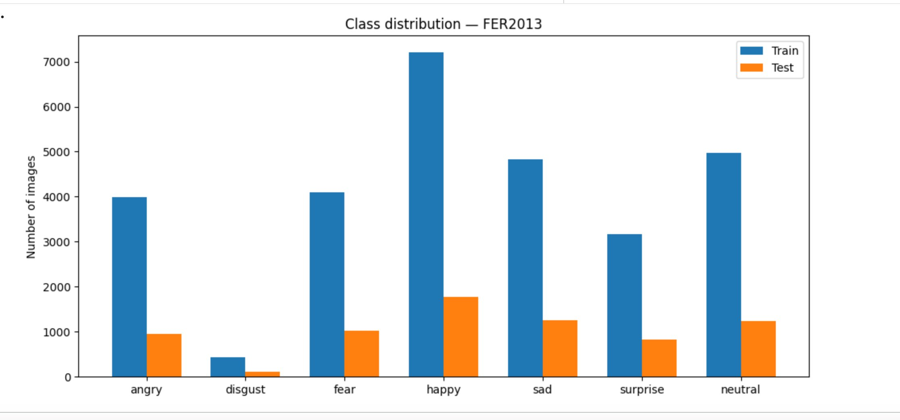
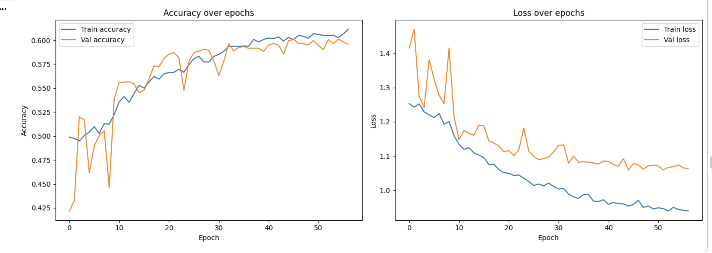
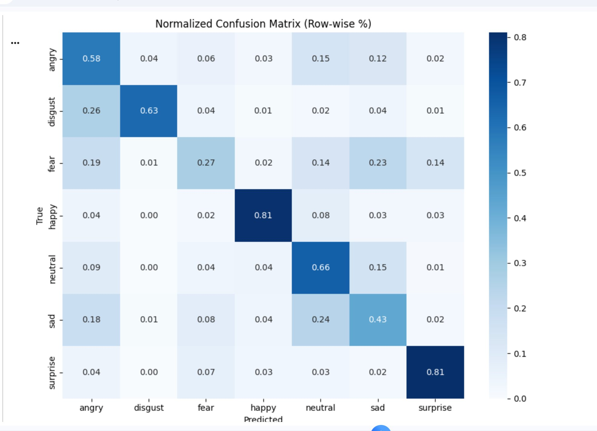
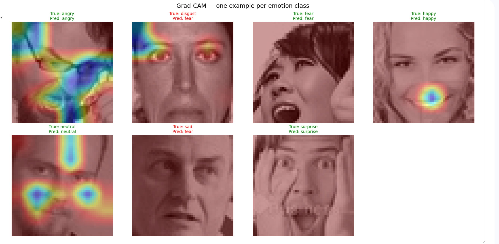
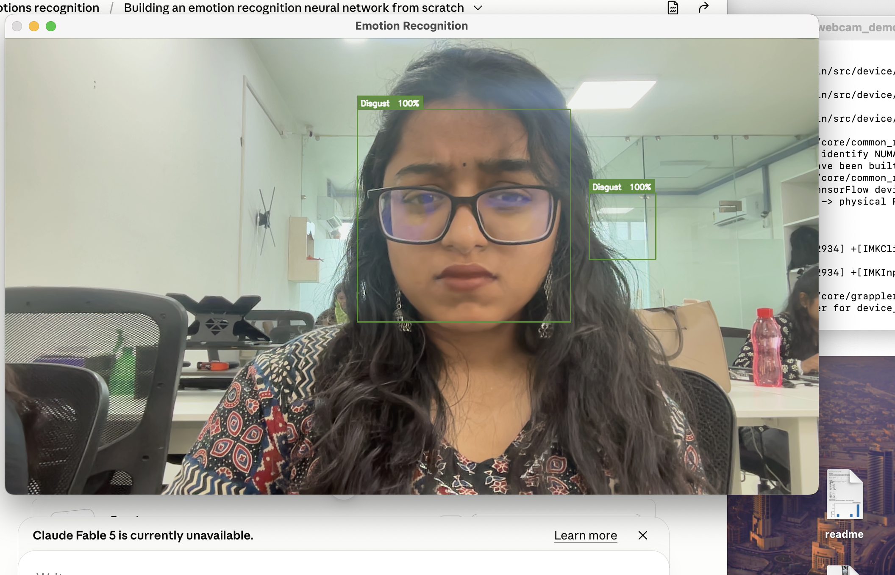
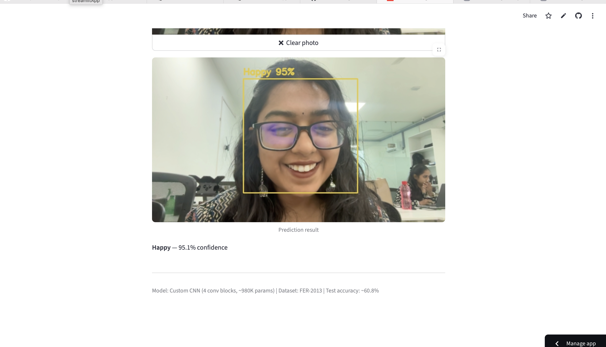

# Facial Emotion Recognition using CNN


A convolutional neural network that classifies facial expressions into 7 emotions, trained from scratch on FER-2013, with explainability (Grad-CAM) and two deployed demos — a real-time local webcam app and a public web app.

**🔗 [Try the live web app](https://emotion-recognition-cnn-affynfbz3eug5yv7utvuas.streamlit.app)**

## Table of Contents

- [Overview](#overview)
- [Problem Statement](#problem-statement)
- [Dataset](#dataset)
- [Data Pipeline](#data-pipeline)
- [Architecture](#architecture)
- [Training](#training)
- [Results](#results)
- [Explainability — Grad-CAM](#explainability--grad-cam)
- [Demos](#demos)
- [Repository Structure](#repository-structure)
- [How to Run](#how-to-run)
- [Key Learnings](#key-learnings)
- [Limitations & Future Work](#limitations--future-work)
- [License](#license)

## Overview

This project builds a facial emotion recognition system using a custom CNN trained on the FER-2013 dataset. It classifies faces into 7 emotions — angry, disgust, fear, happy, sad, surprise, neutral — and includes a live webcam demo and a deployed web app. The project covers the full pipeline: data exploration, preprocessing, model design, training (including debugging a real training failure), evaluation, explainability via Grad-CAM, and deployment.

**Test accuracy: 60.8%** — consistent with published FER-2013 benchmarks and close to the ~65% human inter-annotator agreement reported for this dataset.

## Problem Statement

Facial emotion recognition has applications across healthcare (monitoring patient affect and wellbeing), human-computer interaction, and accessibility tools. This project explores how well a CNN trained from scratch can learn to recognize emotion from a single static face image, using one of the most widely studied — and notoriously difficult — benchmarks in the field.

## Dataset

- **Name:** FER-2013 ([`msambare/fer2013`](https://www.kaggle.com/datasets/msambare/fer2013) on Kaggle)
- **Classes:** angry, disgust, fear, happy, sad, surprise, neutral
- **Format:** 48×48 grayscale images

| Emotion  | Train | Test |
|----------|------:|-----:|
| angry    | 3,995 | 958  |
| disgust  | 436   | 111  |
| fear     | 4,097 | 1,024|
| happy    | 7,215 | 1,774|
| sad      | 4,830 | 1,247|
| surprise | 3,171 | 831  |
| neutral  | 4,965 | 1,233|
| **Total**| **28,709** | **7,178** |

### Class distribution



Disgust is severely underrepresented — roughly **16x fewer** training samples than happy (436 vs. 7,215). This imbalance directly motivated the use of class weighting during training (see [Data Pipeline](#data-pipeline)).

### EDA observations

Looking through the images before touching any model code revealed a few things worth knowing going in:

1. **Label noise is visible even to the naked eye.** Several "neutral" images looked angry or disgusted on inspection, and the dataset has at least one image of a chimpanzee labeled "happy" — a direct result of FER-2013 being built by scraping Google Image Search by keyword rather than human annotation.
2. **I manually reviewed one batch of 32 training images and flagged 6 (18%) as probably wrong.** That's not a small number.

FER-2013's published **human inter-annotator agreement is only ~65%**, which means two humans looking at the same image disagree about a third of the time. A model hitting 60-65% isn't failing — it's essentially matching what humans can do on this data. The confusion between neutral/angry/disgust and fear/surprise isn't the model being bad at its job, it's a reflection of how genuinely ambiguous these images are.

## Data Pipeline

- **Normalization:** Pixel values rescaled from [0, 255] to [0, 1]. Large raw pixel values produce large activations and unstable gradients during backpropagation; normalizing keeps the math well-behaved.
- **Augmentation (training set only):** horizontal flip, rotation (±10°), zoom (10%), brightness jitter (0.8–1.2x). Augmentation is never applied to validation or test data — doing so would make evaluation metrics meaningless, since they'd no longer reflect performance on real, unmodified images. Vertical flip was deliberately excluded, since an upside-down face is not a valid emotion sample.
- **Train/validation split:** 20% of the training set held out for validation (`validation_split=0.2` in `ImageDataGenerator`), so model selection during training never sees the same images used for evaluation.
- **Class weighting:** computed via `sklearn.utils.class_weight.compute_class_weight('balanced', ...)` to counteract the disgust/happy imbalance.

| Emotion  | Weight |
|----------|-------:|
| angry    | 1.0266 |
| disgust  | 9.4016 |
| fear     | 1.0010 |
| happy    | 0.5685 |
| neutral  | 0.8261 |
| sad      | 0.8492 |
| surprise | 1.2933 |

Disgust receives by far the highest weight, since it has the fewest training samples and would otherwise be effectively ignored by the loss function in favor of more common classes like happy.

## Architecture

A custom 4-block CNN, designed and trained from scratch (no transfer learning):

```python
def build_model(input_shape=(48, 48, 1), num_classes=7):
    model = Sequential([

        # Block 1
        Conv2D(32, (3,3), padding='same', input_shape=input_shape),
        BatchNormalization(),
        Activation('relu'),
        MaxPooling2D(2, 2),

        # Block 2
        Conv2D(64, (3,3), padding='same'),
        BatchNormalization(),
        Activation('relu'),
        MaxPooling2D(2, 2),

        # Block 3
        Conv2D(128, (3,3), padding='same'),
        BatchNormalization(),
        Activation('relu'),
        MaxPooling2D(2, 2),
        Dropout(0.25),

        # Block 4
        Conv2D(256, (3,3), padding='same'),
        BatchNormalization(),
        Activation('relu'),
        MaxPooling2D(2, 2),
        Dropout(0.25),

        # Classifier head
        Flatten(),
        Dense(256),
        Activation('relu'),
        Dropout(0.4),
        Dense(num_classes, activation='softmax')
    ])
    return model
```

**Input:** 48×48×1 (grayscale) → **Output:** 7-class softmax probability distribution
**Total parameters:** 980,679 trainable

Filters double at each block (32 → 64 → 128 → 256) while spatial resolution halves (48 → 24 → 12 → 6 → 3), trading spatial detail for richer, more abstract features as depth increases.

### Design choices and rationale

- **`padding='same'`** — keeps each conv layer's output the same spatial size as its input, so only `MaxPooling2D` controls downsampling. This gives precise, predictable control over feature map sizes at every stage, rather than having both convolution and pooling shrink the image unpredictably.
- **BatchNormalization** — normalizes layer outputs across the batch, stabilizing training and allowing higher learning rates.
- **ReLU activation** — introduces non-linearity (without it, stacking layers would be mathematically equivalent to a single linear layer) and is the standard, cheap, well-behaved choice for classification CNNs.
- **Dropout** — randomly zeroes a fraction of neurons during training, forcing the network to not over-rely on any single feature; a key regularizer against overfitting on a relatively small, noisy dataset.
- **Adam optimizer** — adaptive per-parameter learning rates, converges faster and more reliably than plain SGD.
- **Softmax output** — converts the final layer's raw scores into a proper probability distribution over the 7 mutually exclusive emotion classes.

## Training

- **Optimizer:** Adam, initial learning rate 0.001
- **Loss function:** categorical cross-entropy
- **Callbacks:**
  - `ModelCheckpoint` — saves the model whenever validation accuracy improves
  - `EarlyStopping` (patience=10–12) — stops training once validation loss plateaus, restoring the best-performing weights
  - `ReduceLROnPlateau` (factor=0.5, patience=5) — halves the learning rate when validation loss stalls, allowing finer convergence
- **Class weights** applied during `model.fit()` to address the disgust imbalance
- **Total training:** ~35 epochs to reach a stable baseline, continued to 60 epochs with full callbacks for the final model

### The debugging story

The first version of this architecture **completely failed to learn** — training accuracy stayed near random chance (~20%) for 74 straight epochs. Not slowly improving. Just flat. The original design stacked BatchNorm, dropout (0.25) on every single block, L2 regularization, and class weighting all at once from layer one.

To figure out what was actually wrong, I stripped everything back to a minimal 2-block model with no regularization at all and trained that on the same data. It learned immediately — 30% → 45% in 5 epochs. That told me the data pipeline was fine and the problem was the architecture itself: too much regularization too early was killing the gradient signal before the network could learn anything.

The fix was simple once diagnosed — remove dropout from the first two blocks, drop L2 entirely, keep BatchNorm throughout but let the early layers actually breathe. After that change, the model trained normally and reached 60.1% validation accuracy.

The bigger lesson: a model that runs without crashing is not the same as a model that's actually learning. If I'd just stared at the code without running a controlled experiment, I'd probably still be tweaking hyperparameters.

### Training curves



## Results

- **Validation accuracy:** 60.1%
- **Test accuracy:** 60.78%
- The <1% gap between validation and test accuracy indicates the model generalizes consistently and is not overfit to the validation set.

### Per-class metrics

| Emotion  | Precision | Recall | F1-score | Support |
|----------|----------:|-------:|---------:|--------:|
| angry    | 0.453 | 0.585 | 0.510 | 958  |
| disgust  | 0.534 | 0.631 | 0.579 | 111  |
| fear     | 0.486 | 0.273 | 0.350 | 1024 |
| happy    | 0.890 | 0.806 | 0.846 | 1774 |
| neutral  | 0.521 | 0.660 | 0.582 | 1233 |
| sad      | 0.469 | 0.430 | 0.449 | 1247 |
| surprise | 0.728 | 0.810 | 0.767 | 831  |
| **accuracy** | | | **0.608** | 7178 |
| macro avg | 0.583 | 0.599 | 0.583 | 7178 |
| weighted avg | 0.613 | 0.608 | 0.603 | 7178 |

### Confusion matrix (row-normalized)



### Interpretation

Happy and surprise are the strongest classes — both hit around 81% recall. These are the most visually unambiguous emotions: a smile is a smile, and the wide-eyes/open-mouth combo for surprise is pretty distinct. Fear is the weakest by a significant margin (27% recall), getting confused with sad, angry, and neutral constantly. Looking at the images, this makes sense — fear and surprise share a lot of the same facial geometry, and fear samples in FER-2013 are particularly noisy. Disgust actually holds up reasonably well given it only has 111 test samples — the class weighting helped. Sad is the other underperformer (43% recall), mostly leaking into neutral and angry, which again reflects how visually similar those expressions can be at 48×48 grayscale resolution.

## Explainability — Grad-CAM



Grad-CAM visualizations show *where* the model is actually looking when it makes a prediction — by backpropagating gradients to the last conv layer to see which spatial regions drove the output.

- **Happy** → the model zeroes in on the mouth. Makes sense — a smile is the defining feature and there's not much ambiguity here.
- **Surprise** → eyes and mouth both light up, matching the wide-eyes/open-mouth expression.
- **Neutral** → attention is diffuse, spread across cheeks, forehead, and nose. There's no single feature that screams "neutral", so the model apparently just takes in the overall face structure.
- **Angry** → focus on the brow and eye region, consistent with furrowed/tense expressions.
- **Misclassified cases** (disgust predicted as fear, sad predicted as fear) → in both cases the heatmap pulls toward the eye region. This suggests the model is pattern-matching "unusual eye area" as fear regardless of context — which explains a lot of its confusion between these classes.

The errors aren't random. They track with real visual similarity between the emotion classes, which lines up with everything the confusion matrix shows.

### A note on real-world deployment

When I tested the deployed app on selfie photos (including my own), it predicted "disgust" on a clearly smiling face at 93% confidence. That's not a code bug — it's a domain gap. FER-2013 images are low-resolution, mostly glasses-free, and taken under relatively controlled conditions. Real webcam photos have different lighting, glasses, head tilts, and background variation that the model never encountered during training. A 60.8% score on the FER-2013 test set means the model works well on data that looks like its training data — it doesn't mean it handles everything a real camera will throw at it.

## Demos

This project includes two complementary demos.

### 1. Local real-time webcam demo

Runs continuous, frame-by-frame emotion detection directly from a laptop webcam using OpenCV — true real-time performance.

**Pipeline:** webcam frame → Haar Cascade face detection → crop face → grayscale → resize to 48×48 → normalize → CNN prediction → label overlaid on live video.



```bash
git clone https://github.com/nirshigarg/emotion-recognition-cnn.git
cd emotion-recognition-cnn
python3 -m venv venv
source venv/bin/activate
pip install -r requirements.txt
python3 webcam_demo.py
```

Press `q` to quit.

### 2. Live web app (Streamlit)

A browser-based version anyone can try with no installation.

**Try it here:** https://emotion-recognition-cnn-affynfbz3eug5yv7utvuas.streamlit.app



Supports both **photo upload** and **camera snapshot** modes. Note: due to how Streamlit's rerun-on-interaction architecture works, the web version captures single snapshots rather than continuous video — click "Take Photo" to get a prediction. For continuous real-time video, use the local demo above.

> **Deployment note:** the trained model was exported from Google Colab as **weights only** (`.weights.h5`) rather than a full saved model, due to a Keras version mismatch between Colab's environment and local/deployment TensorFlow versions that broke full-model deserialization. The architecture is rebuilt in code and weights are loaded directly — a more portable approach generally, since architecture code ages better across library versions than serialized model configs.

## Repository Structure

```
emotion-recognition-cnn/
│
├── README.md
├── requirements.txt
├── LICENSE
├── .gitignore
│
├── notebooks/
│   └── FER2013_full_pipeline.ipynb     # full EDA → training → evaluation notebook
│
├── app.py                              # Streamlit web app
├── webcam_demo.py                      # local real-time OpenCV demo
├── emotion_weights.weights.h5          # trained model weights
│
└── assets/
    ├── class_distribution.png
    ├── confusion_matrix.png
    ├── gradcam_grid.png
    ├── training_curves.png
    ├── webcam_demo_screenshot.png
    └── streamlit_app_screenshot.png
```

## How to Run

### Training (Google Colab)

1. Open a new Colab notebook, enable GPU runtime
2. Download the dataset: `kagglehub.dataset_download("msambare/fer2013")`
3. Run the full pipeline notebook in `notebooks/FER2013_full_pipeline.ipynb` — EDA → data generators → model build → training → evaluation → Grad-CAM
4. Export trained weights: `model.save_weights('emotion_weights.weights.h5')`

### Webcam demo (local)

```bash
git clone https://github.com/nirshigarg/emotion-recognition-cnn.git
cd emotion-recognition-cnn
python3 -m venv venv
source venv/bin/activate
pip install -r requirements.txt
python3 webcam_demo.py
```

### Web app (local test before deploying)

```bash
streamlit run app.py
```

## Key Learnings

A few things I'd want to tell myself at the start of this project:

- **Training accuracy stuck at 20% for 74 epochs is not a hyperparameter problem.** It's a signal that something fundamental is broken — either the data pipeline or the architecture. Running a stripped-down baseline was the only thing that actually told me which.
- **FER-2013's accuracy ceiling is ~65% and that's a real constraint, not an excuse.** Spending time trying to squeeze out more accuracy on a dataset where humans themselves disagree 35% of the time has diminishing returns — understanding why the ceiling exists matters more than chasing it.
- **Grad-CAM is more useful than I expected.** I added it expecting a nice visualisation for the demo. It actually explained the confusion matrix — the misclassified examples showed attention in the wrong places, which is genuinely actionable diagnostic information, not just a pretty heatmap.
- **The gap between test accuracy and real-world performance is real.** 60.8% on the test set felt solid until the live demo predicted "disgust" on a smiling face. Benchmark numbers only tell you how the model performs on data that looks like its training distribution — which is a narrower thing than it sounds.

## Limitations & Future Work

- **Disgust** remains the weakest-supported class by raw data volume (436 training images), and despite class weighting, real-world performance on disgust is likely less reliable than the table above suggests.
- **Fear** is the model's clearest weakness (27% recall), heavily confused with sad, angry, and neutral — likely a mix of genuine visual overlap and label noise.
- **Domain gap** between FER-2013's lab-like images and real-world webcam photos (lighting, glasses, head angle) reduces real-world reliability.
- **Future improvements:** transfer learning (e.g. MobileNetV2) for a stronger feature backbone, face alignment preprocessing to normalize head pose before classification, additional disgust samples or synthetic augmentation, and prediction smoothing (temporal averaging) for the live webcam demo to reduce frame-to-frame label flicker.

## License

This project is licensed under the MIT License — see [LICENSE](LICENSE) for details.

---

**Stack:** Python, TensorFlow/Keras, OpenCV, scikit-learn, Streamlit | **Dataset:** [FER-2013](https://www.kaggle.com/datasets/msambare/fer2013)
